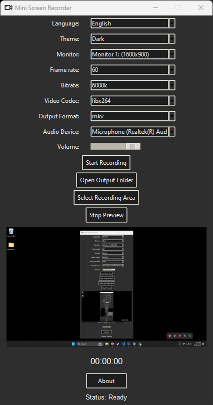

# Mini Screen Recorder

It's an open-source screen and audio recorder for Windows and Linux.

<p align="center">
  
</p>

## Features

- Select theme
- Set frame rate
- Set bitrate
- Choose video codec
- Select output format
- Select audio device
- Select recording area
- Support for multiple monitors
- Multi-language support

## Video Demo

Just a simple gameplay recorded with this app. Click the badge to watch the video:

[](https://youtu.be/7Ji-maVmPac)

## Requirements to run the application

### Windows Users

If you download the packaged .exe file from the [Releases](https://github.com/Lextrack/MiniScreenRecorder/releases) section, you **do not** need to install Python, FFmpeg, or any additional libraries. Everything is included in the executable.

But if you want to test on the Windows script (miniscreenrecorder.py) first install the latest version of Python and then run these packages in the CMD:

    pip install pillow mss numpy opencv-python screeninfo

### Linux Users

You need to have Python 3.x and FFmpeg installed on your system, beside the additional libraries. 

As you suspect, the main file to run the app on Linux it's **miniscreenrecorderLinux.py**.

### To run this app you must install these libraries

For Linux (Debian), run this in your terminal:

    sudo apt-get update
    sudo apt install python3
    sudo apt install python3-pip
    pip install pillow mss numpy opencv-python screeninfo
    sudo apt-get install python3-pil.imagetk

## How to install FFmpeg for Linux (Debian)

  1. Update the package index:
      ```bash
      sudo apt update
      ```
  2. Install FFmpeg:
      ```bash
      sudo apt install ffmpeg
      ```
  3. Verify the installation:
      ```bash
      ffmpeg -version
      ```

## Known issues

### Warning about User Account Control

To prevent Windows UAC prompts from interrupting recording, you should select the second-to-last option, which says **Notify me only when apps try to make changes to my computer (do not dim my desktop)**. Or, if you want, completely disable it.

### Sometimes, the recording is not as smooth as I would like it to be.

Well, there are several experimental settings in the application, but the configuration that gives the **best results** is with the **libx264 codec and the mkv format**.

### Why can't I record the system audio?

Just activate the Stero Mix in the sound settings (in the Recording tab you can find it).

## License

This project is licensed under the MIT License. See the LICENSE file for details.
