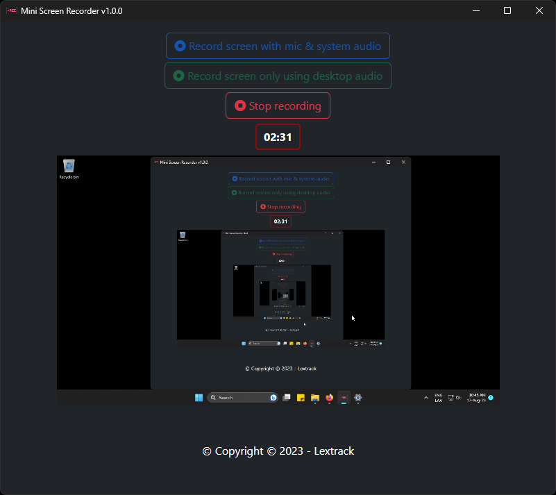

# Mini Screen Recorder

<h2 align="center">Introduction</h2>

It's a simple web application to record your screen. The best part about it is that you can use it as a web application from <a href="https://lextrack.github.io/MiniScreenRecorder/" target="_blank">HERE</a>.

<h2 align="center">Advices</h2>

Optionally, you can create your own build for any platform you prefer using Nativefier. However, I don't recommend this option because it might prevent you from recording desktop audio in a desktop application.

If you are looking for a more advanced recorder with different encoders, file formats, bitrates, FPS settings, and a monitor selector, you can explore my other <a href="https://github.com/lextrack/Simple-Screen-Recorder" target="_blank">project</a> (available only for Windows).

<h2 align="center">Acknowledgments</h2>

Thanks to Flaticon for the icon and dhruv479 for give me the idea to create this.

